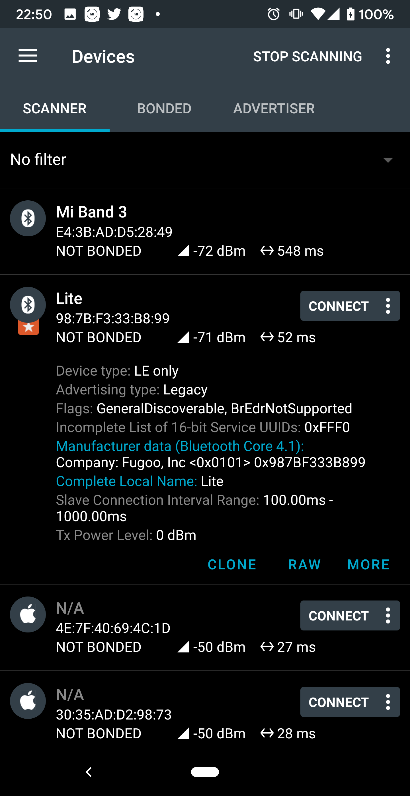

This project is about controlling a smartbulb or a rgb led bulb over bluetooth using your computer.You can use anything from aliexpress,amazon or anywhere and the process of setting it up remains the same.
I used iota lite from reos because that company removed its app from the playstore and i had to download apks from unreliable sources for it to work.
Your inspiration can be pure curiosity which was in my case 70%.

Now this project involved three steps

- Sniffing bluetooth packets being sent to he bulb
- Decoding the pattern of the packets for changing colors
- Using your favourite platform or programming language (or app) to send that data and watch it work

# Step 1 :- Sniffing bluetooth packets
So i first used nRF connect app on android to scan for the bulb after i turned it on.
I found out the various services exposed by it, and try to find out the various characteristics or features which can be modifed in that service.

For most bulbs this till now may be sufficient and you can get the pattern of the packet required to change a color but for me it was not sufficient
So i went a step ahead and i needed to enable bluetooth hci snooping in android develper options to collect bluetooth logs on the device.
Then i downloaded the reos apk and installed it on my mobile, used it to connect to it and change it to various colors and various patterns ,modes,intensity.
Then i sent the log file from android to my pc and used wireshark to analyse those packets.
For that rename the file with the extension .pcap and open it with wireshark.

# Step 2 :- Decoding
So this is the process where we try to figure out how the rgb pattern is sent to the bulb.
It can be different in your case based on the bulbs manufacturer.
So in my case i collected some packets from wireshark, went under bluetooth attribute protocol section and then collected the values like one shown below:

0f0d0300b6ff00c800000100000082ffff

Now the above string is a string of hex codes and can be broken down as below

0f0d0300 b6ff00 c8 000001000000 82 ffff

So i have separated it using spaces , the first and the last part is always fixed, the pattern with zeroes and ones, the fourth string is also fixed
The second string is the rgb value - b6ff00 (r,g,b). The next value c8 is the intensity and the string before the ffff end string i.e ed is the checksum from the rgb value and the intensity.
Now i had to look through several packets to decode this pattern and find out how the checksum is calculated which in this case was simple
1)Subtract each rgb value from 255 (highest 16 bit decimal number) , so in this case 255 minus decimal values of b6, ff and 00 which are 182, 255 and 0.
So i get 73,0 and 255.
I then calculate the decimal value of intensity i.e c8 which is 200 and subtract it from 255, so i get 55.
Now i add these values and if you get a value greater than 255 you subtract 255 from it , so 73+0+255 is 73.Then add 55 to it as well and we get 128.
I then subtract three from it , i think the three in the first hex string denotes that too i am not sure(0f0d0300).
Then i get 128-3 , 125.
Now the difference between this and 255, that is 130 , when you convert it to hext you will get the value 82.
In this way you can create any color for this bulb and create a hex string and send it to it

# Step 3) Writing code in node
This is the easiest of the three and just involves using node to send this color hex string to the bulb.
Now i used a npm package called noble , which can be used with any ble enabled device, i used a fork of it called noble- mac which works on top of noble for mac.

Now i used node to scan for nearby devices, filtered them on the basis of mac address to pinpoint the bulb and voila.
You can use the index.js file to send any value to the bulb, and the random.js file for generate a hex string for a random color for this bulb.

Have a good day

